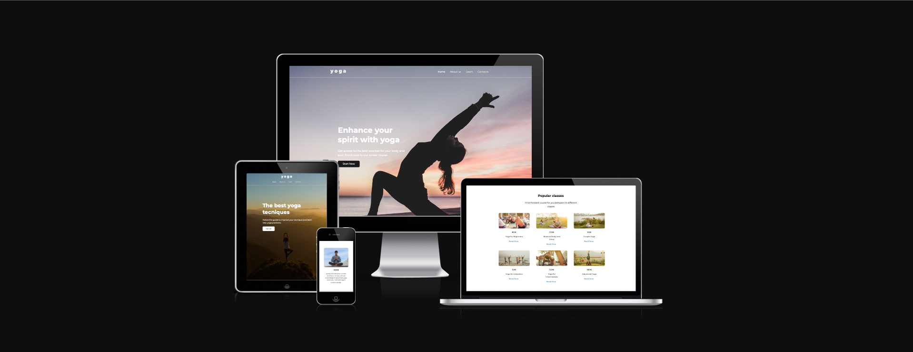
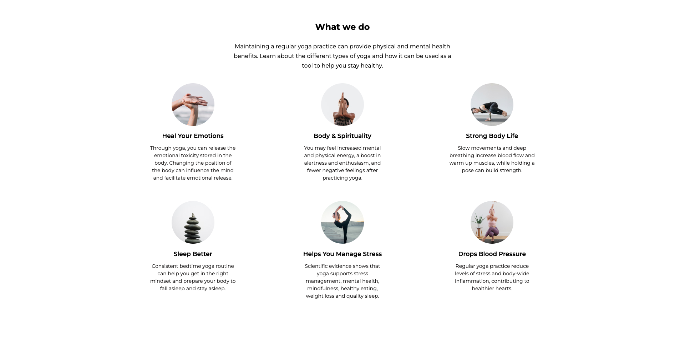
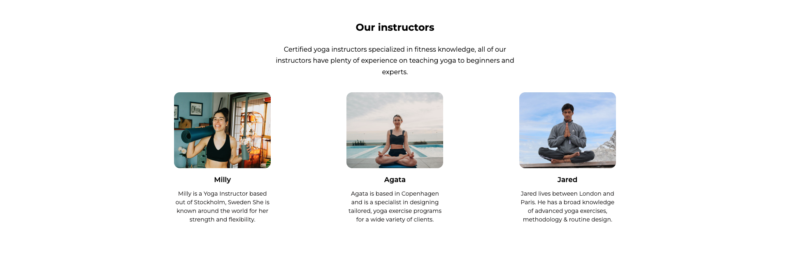
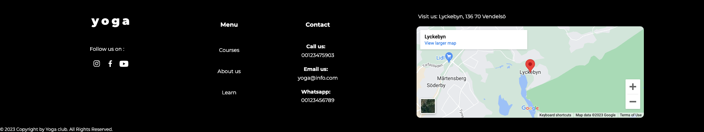
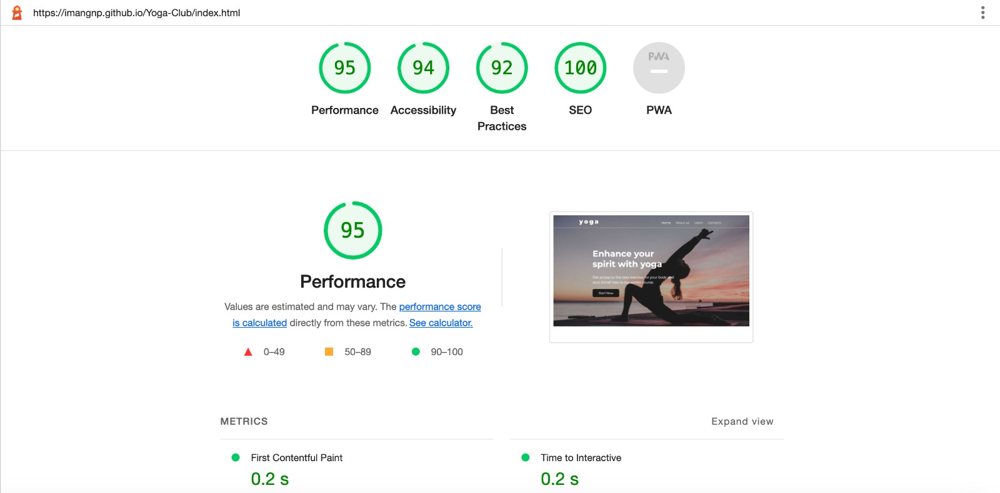

------

# Yoga club

Yoga project is a simple website dedicated to Yoga and lessons on yoga techniques.This website allow users to learn about yoga and its benefits. It also guide the user through  different courses, to whom they apply by signing up to the online classes directly from the website.

Nowadays life is full of rush, stress and irritability. We offer courses that can help you gain mental balance, better sleep and a new vitality.Yoga is mind and body practice. It involves movement, meditation, and breathing techniques to promote mental and physical well-being. Meditation will improve your concentration and enrich your life with a new creativity. It helps you to remove inner obstacles and gives us the fortitude to stay cool, calm and collected when confronted with the everyday challenges of modern life.

We teach classical yoga with an holistic approach to strengthen and harmonise the body, the mind and the soul, so that we can achieve our goal of a healthy body, a balanced mind and inner peace. You are welcome to apply with a friend or bring the entire family. Our courses are open  to every level, either you are advance or beginner. Everyone is welcome to join.

# Features

**The land page layout is divided in 4 sections:**
> - ***Navigation bar***
> - ***Header***
> - ***Content***
> - ***Footer***

- ## Navigation Bar 
The Nav Bar is located at the top of the page and it hosts the logo on the left, while on the right it hosts the links to other pages of the website: About us, Classes, Learn, Contacts.
The Nav bar helps the user to clearly navigate through the pages of the website.

- ## Header
The header is composed of a full screen image as background and a paragraph on the right with CTA (Call to action) button. 
The paragraph shares the key information regarding the purpose of the website, while the CTA button invites the user to sign up to the offering. 
The CTA triggers a sign up flow, which is valuable to the user as it gives them the ability to sign up and join the online classes.

- ## Content
The contents of the page are divided in 5 sections:
1. “What we do” explains the benefits of the yoga classes;

2. “Our Instructors” it’s a presentation of the instructors that will attend the courses;

3. A section dedicated to review from former students.

4. “Popular classes” is a list of the most featured yoga classes.

5. News letter subscription: urge the user to subscribe to the newsletter and get info on the classes.

- ## The Footer
In the footer the user can find contact info and the address of the yoga institute. I also includes links to social media (instagram, Facebook, YouTube) and the location map.
It’s important as allowed the user to find all the information helpful to contact the site.

- ## The Learn page

**The Learn page layout is divided in 3 sections:**
> - ***Header***
> - ***Content***
> - ***Footer***

- ### Content
This section is dedicated to the explanation of different yoga position. The content is limited, the user can access to the entire manual after signing up. The sign up process is triggered by clicking on the CTA stated “sign up”. Below this section the user will face the news letter subscription section, where the user can subscribe in order to be up to date on the classes and offers.

<!-- here the image comming -->

- ## The Sign Up page

Before accessing to all the content, the user will need to sign up. Any time the user press the CTA button, the sign up window will popup.
- In the form the user is asked to enter the following data:
    - Email
    - Password
    - Date of birth
    - Gender
    - Goals
    

The user can fill the Email and Password in a free text field.
While Date of Birth can be entered either by typing in or selecting from the calendar triggered by the drop down menu.
The gender selection is applied by selecting one of the radio buttons.

The goals can be many, that’s why the user can select multiple check boxes.

Once filled the form, the user is asked to click “Sign up” to complete the process.

# Testing

The website is fully responsive has been tested by https://ui.dev/amiresponsive. It adapts to the smallest mobile screens and to the largest desktop ones.
It also resizes for medium size devices such as iPads and small laptops. 

The breackpoint are set at 490px, 600px, 900px, 1200px, 1300px, 1600px.

It is supported from the following browsers: Google Chrome, Safari, Firefox.
## Validator Testing
- HTML
    - No errors were returned when passing through the official [W3C validator](https://validator.w3.org/)
    
- CSS
    - No errors were found when passing through the official [Jigsaw validator](https://jigsaw.w3.org/)
    
- Accessibility
    - I confirm that the colors and fonts choosen are easy to read and accessible by running it through light house in devtools.
    

# Deployment

- The site was deployed to GitHub pages. The steps to deploy are as follows:
    - In the GitHub repository, navigate to the Settings tab
    - From the source section drop-down menu, select the Master Branch
    - Once the master branch has been selected, the page will be automatically refreshed with a detailed ribbon display to indicate the successful deployment.

# Credits

## Content
- Text content is gathered from multiple websites dedicated to yoga, such as:  https://chopra.com/articles/healing-emotional-pain-with-yoga ;
https://osteopathic.org/what-is-osteopathic-medicine/benefits-of-yoga/ ; https://www.hopkinsmedicine.org/health/wellness-and-prevention/9-benefits-of-yoga ; https://www.americansportandfitness.com/products/yoga-certification. 
- The font Monserrat is a free font from Google Fonts (https://fonts.google.com/specimen/Montserrat)
- The footer Icons were taken from Material Design library.

## Media
- The logo of the website is designed in Figma.
- All the images used in the project are copyright free from [unsplash.com](https://unsplash.com/)

# Other General Project Advice

## Technologies
- The website has been coded entirely in HTML and CSS.

