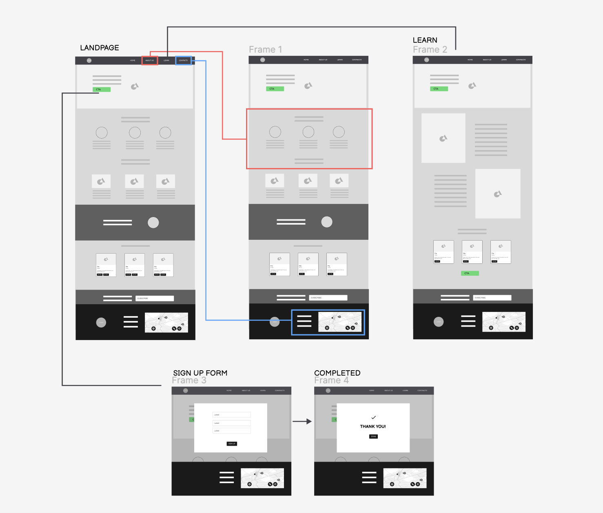
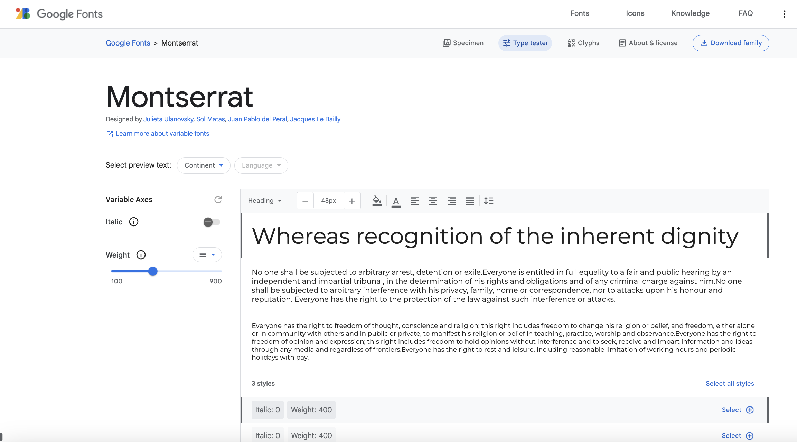
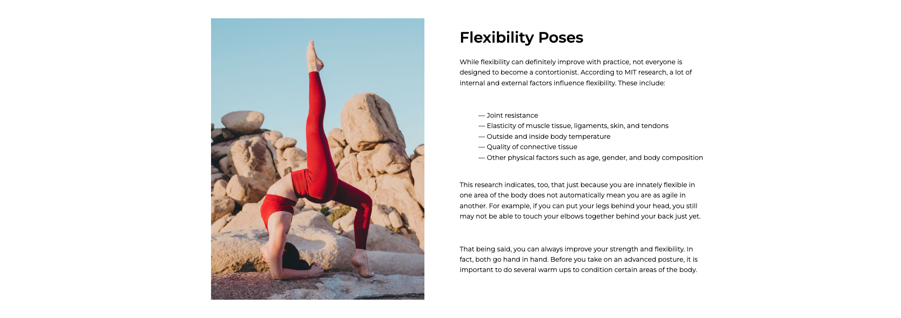
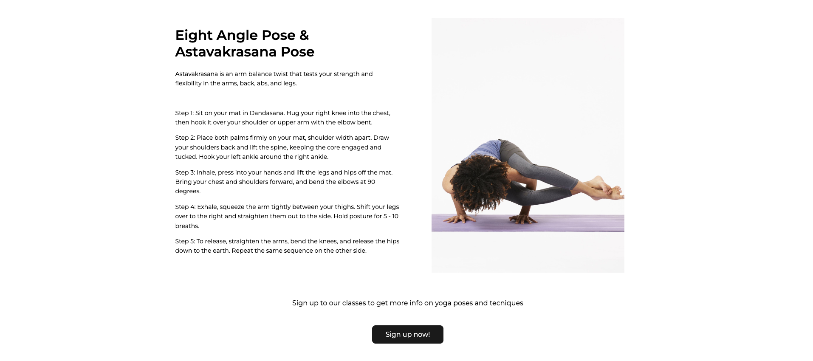
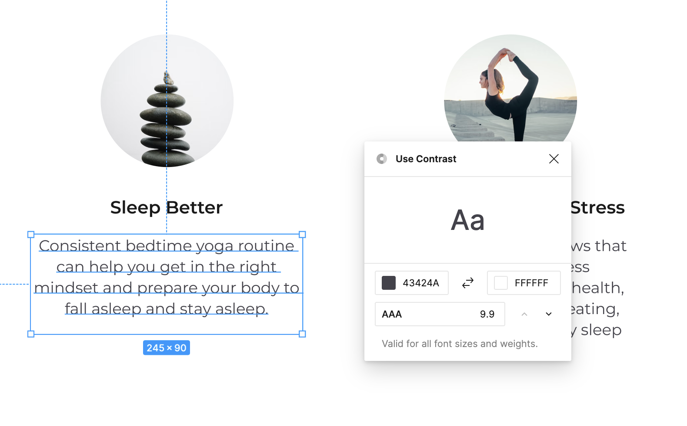
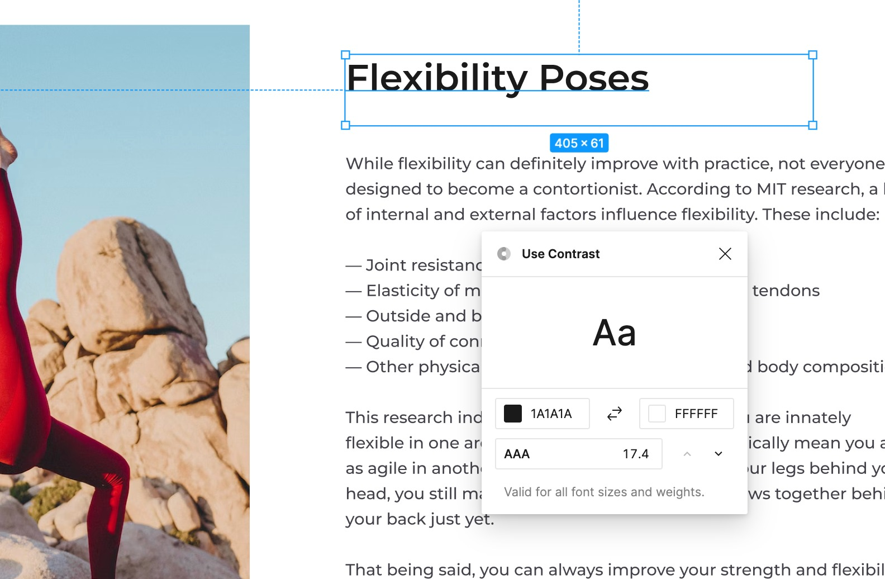
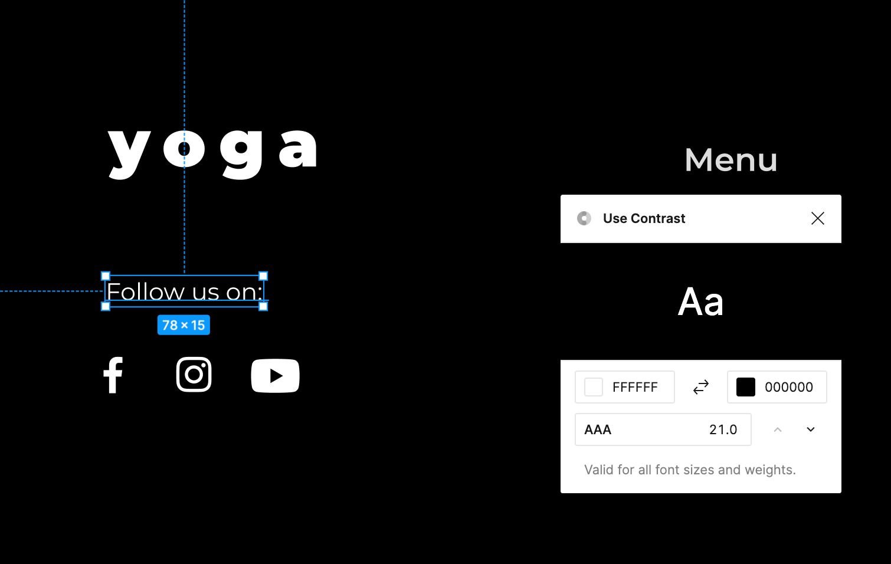
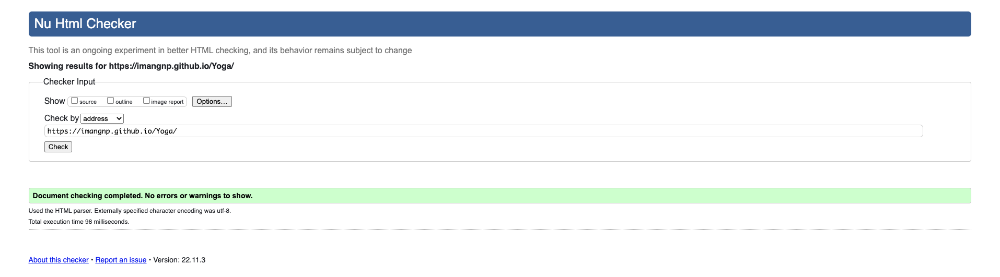
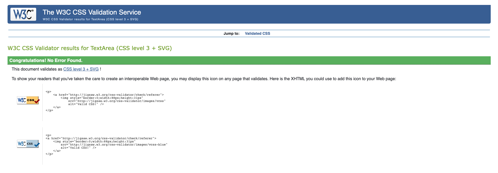

# Yoga club

Welcome to Yoga Club, an online platform that offers comprehensive online yoga courses and lessons to users. The website's goal is to improve users' mental and physical well-being through the practice of yoga. It features classical yoga practices like movement, meditation, and breathing exercises, which are taught by certified instructors. The courses are designed to be accessible and interactive, and cater to both beginner and advanced practitioners.

You can find the live link here: [Yoga Club](https://imangnp.github.io/Yoga-Club/)

___

# Table of Contents

- [Overview](#Overview)
- [User Experience](#user-experience)
    * [User Stories](#user-stories) 
    * [Wireframe mockups](#wireframe-mockups) 
- [User Interface](#user-interface)
    * [Color scheme](#color-scheme) 
    * [Typography](#typography)
 - [Structure](#structure) 
    * [Home Page](#home-page) 
    * [Learn Page](#learn-page)
    * [Sign Up Page](#signup-page)  
    * [Thank You page](#thank-you-page)
    * [Subscription](#subscription)
    * [404 Error page](#404-error-page)
- [Testing](#testing)
    * [Accessibility](#accessibility)
    * [Validators Testing](#validators-testing)
    * [Manual Testing](#manual-testing)
- [Technologies](#technologies) 
- [Deployment](#deployment)
    * [Deployment](#deployment) 
    * [Local Development](#local-development)
- [Credits](#credits)
- [Future Scope](#future-scope)
- [Bugs](#bugs)
- [Acknowledgements](#acknowledgements)

---

# Overview
Yoga Club provides users with an online platform for practicing yoga and improving their well-being. The courses cover a wide range of topics, from the basics to advanced techniques, and are taught by certified instructors. Users can access the courses from the comfort of their own home and receive personalised instruction. Users can sign up for online courses and by participating in the courses and subscribing to the monthly newsletter, can deepen their understanding of yoga and build a strong, sustainable practice that supports their physical and mental well-being. Whether you are a beginner or an advanced practitioner, Yoga Club is designed for your needs and help you achieve a healthy body, balanced mind, and inner peace through the practice of yoga.

# User Experience
## User Stories
- As a user, I want to be able to simply navigate the page.
- As a user, I want to be able to read and understand the topic of the website.
- As a user, I want to be able to understand the offering.
- As a user, I want to be able to sign up to the classes I am interested to.
- As a user, I want to be able to have an overview of the instructors and teachers.
- As a user, I want to be able to learn more about yoga techniques.
- As a user, I want to be able to contact the yoga institute if I need more information.
- As a user, I want to be able to be able to sign up to the newsletter.
- As a user, I want to be able to be able to sign to the online courses.

## Wireframe mockups

# User Interface
## Color scheme
The colour scheme is inspired by the natural colours of the nature and the philosophical concept of Yin and Yang that describes opposite but interconnected forces. Here the black and white of the two forces symbolise the body and the soul. Yoga helps to build a bridge within the material and the etherial. 

## Typography
- The font utilised in the entire Project is Montserrat.
- Montserrat is a geometric sans-serif typeface, with smooth and elegant waves that makes it aesthetically appealing. 
- It is part of the Google font library [Google Fonts](https://fonts.google.com/specimen/Montserrat) 
- The font has been adopted in the selected weight: Bold, Semibold, Regular and Thin.

# Structure
## Home page
**The Home page layout is divided in 4 sections:**
>#### - ***Navigation bar***
>#### - ***Header***
>#### - ***Content***
>#### - ***Footer***

- ## Navigation Bar 
The Nav Bar is located at the top of the page and it hosts the logo on the left, while on the right it hosts the links to other pages of the website: About us, Classes, Learn, Contacts.
The Nav bar helps the user to clearly navigate through the pages of the website.

- ## Header
The header is composed of a full screen image as background and a paragraph on the right with CTA (Call to action) button. 
The paragraph shares the key information regarding the purpose of the website, while the CTA button invites the user to sign up to the offering. 
The CTA triggers a sign up flow, which is valuable to the user as it gives them the ability to sign up and join the online classes.

- ## Content
The contents of the page are divided in 4 sections:
1. “What we do” explains the benefits of the yoga classes.

2. “Our Instructors” it’s a presentation of the instructors that will attend the courses.

3. A section dedicated to review from former students.

4. “Popular classes” is a list of the most featured yoga classes.

5. "Newsletter subscription": urge the user to subscribe to the newsletter and get info on the classes.

- ## The Footer
In the footer the user can find contact info and the address of the yoga institute. I also includes links to social media (instagram, Facebook, YouTube) and the location map.
It’s important as allowed the user to find all the information helpful to contact the site.

## Learn page

**The Learn page layout is divided in 3 sections:**
>#### - ***Navigation bar***
>#### - ***Header***
>#### - ***Content***
>#### - ***Footer***

- ## Content
This section is dedicated to the explanation of different yoga position. The content is limited, the user can access to the entire manual after signing up. The sign up process is triggered by clicking on the CTA stated “sign up”. Below this section the user will face the news letter subscription section, where the user can subscribe in order to be up to date on the classes and offers.

## Sign Up Page

Before accessing to all the content, the user will need to sign up. Any time the user press the CTA button, the sign up window will popup.
- In the form the user is asked to enter the following data:
    - Email
    - Password
    - Date of birth
    - Gender
    - Goals
    
The user can fill the Email and Password in a free text field.
While Date of Birth can be entered either by typing in or selecting from the calendar triggered by the drop down menu.
The gender selection is applied by selecting one of the radio buttons.

The goals can be many, that’s why the user can select multiple check boxes.

Once filled the form, the user is asked to click “Sign up” to complete the process.

## Thank You page
After successfully completing the Sign Up form, you will be redirected to the Thank You page. The purpose of this page is to acknowledge and confirm that your form has been completed and to inform you that you can check your email for additional information or instructions. A button also is provided on the page which, when clicked, will redirect you to the Home page.
The Thank You page is an important part of the user experience and is designed to increase your satisfaction and build trust with the service.

## Subscription page
Upon entering their email address in the provided box and clicking the "Subscribe" button, users are redirected to the subscription confirmation page. This page informs users of successful subscription and states that a confirmation email will be received. Additionally, a button is provided on the page which, when clicked, redirects users back to the Home page.

## 404 Error page
A 404 page is a webpage displayed when a user attempts to access a non-existent or broken link on a website. The purpose of a 404 page is to inform the user that the requested page could not be found and provide options for them to navigate the website and find the information they were looking for. A well-designed 404 page can also help maintain a positive user experience by providing links to popular pages, a search bar, or a contact form for assistance.

# Testing
## Accessibility
Accessibility was run during design on Figma with the plug in “Use contrast” in order to make sure the color contrast was meeting the WCAG standards.

## Responsiveness
The website is fully responsive has been tested by https://ui.dev/amiresponsive and https://responsivedesignchecker.com . It adapts to the smallest mobile screens and to the largest desktop ones.
It also resizes for medium size devices such as iPads and small laptops. 

The breackpoint are set at 490px, 600px, 900px, 1200px, 1300px, 1600px.

### - Desktop screen

### - Notebook screen

### - Tablete screen

### - Mobile screen

The website is supported from the following browsers: Google Chrome, Safari, Firefox.

## Validators Testing
- HTML
    - No errors were returned when passing through the official [W3C validator](https://validator.w3.org/)
    

- CSS
    - No errors were found when passing through the official [Jigsaw validator](https://jigsaw.w3.org/)
    

- Accessibility and performance
    - I confirm that the colors and fonts choosen are easy to read and accessible by running it through light house in devtools.
    

## Manual Testing
### Buttons
| **Feature** | **Test Case** | **Expected** | **Result** |
|:-----------:|:-------------:|:------------:|:----------:|
| Start Now button | Click it | Go to Sign Up page when user click it | Works as expected |
| Sign Up button | Fill out the form and click Sign Up button | Go to Thank You page | Works as expected |
| Sign Up button | Click Sign Up button without filling out the form | "please fill out this field" popup message | Works as expected |
| Subscribe button | Enter email and click Subscribe button | Go to Subscription page | Works as expected |
| Subscribe button | Click Subscribe button without entring email | "please fill out this field" popup message | Works as expected |
| Book now text button | Click it | Go to Sign Up page | Works as expected |

### In the Footer
| **Feature** | **Test Case** | **Expected** | **Result** |
|:-----------:|:-------------:|:------------:|:----------:|
| Logo | Click it | Go to Home page | Works as expected |
| Courses text button | Click it | Go to "Popular classes" section in Home page | Works as expected |
| About us text button | Click it | Go to "What we do" section in Home page | Works as expected |
| Learn text button | Click it | Go to Learn page | Works as expected |
| Social network icons | Click it | Open another window to the relative website | Works as expected |

# Technologies
- Languages: 
  - HTML
  - CSS

# Deployment
## Deployment
- The site was deployed to GitHub pages. The steps to deploy are as follows:
    1. In the GitHub repository, navigate to the Settings tab
    2. From the side menu to your left, select "Pages" in the "Code and automation" section.
    3. From the source section drop-down menu, select the Main Branch
    4. Once the main branch has been selected, the page will be automatically refreshed with a detailed ribbon display to indicate the successful deployment.
    

## Local Development
- The steps to fork a repository are as follows:
    1. Go to the GitHub repository that you want to fork.
    2. Click the "Fork" button on the top-right corner of the repository page.
    3. Select the account you want to fork the repository to.
    4. Wait for the repository to be forked to your account.

- The steps to clone a repository are as follows:
    1. Go to the repository you want to clone on GitHub.
    2. Click the "Code" button at the top of the files section of the page.
    3. Copy the repository's URL by clicking the "Clone or download" button and selecting "HTTPS" option.
    4. Open a terminal or command prompt window.
    5. Change to the directory where you want to clone the repository.
    6. Type git clone followed by the repository URL you copied in step 2, then press Enter.

# Credits
## Content
- Text content is gathered from multiple websites dedicated to yoga, such as:  https://chopra.com/articles/healing-emotional-pain-with-yoga ;
https://osteopathic.org/what-is-osteopathic-medicine/benefits-of-yoga/ ; https://www.hopkinsmedicine.org/health/wellness-and-prevention/9-benefits-of-yoga ; https://www.americansportandfitness.com/products/yoga-certification. 
- The font Monserrat is a free font from Google Fonts (https://fonts.google.com/specimen/Montserrat)
- The footer Icons were taken from Material Design library.

## Media
- The logo of the website is designed in [Figma](https://www.figma.com/).
- [Favicon.io](https://favicon.io) tool used to create favicon.
- All the images used in the project are copyright free from [unsplash.com](https://unsplash.com/):
   - https://unsplash.com/photos/F2qh3yjz6Jk
   - https://unsplash.com/photos/I2YSmEUAgDY
   - https://unsplash.com/photos/dlxNvA7p
   - https://unsplash.com/photos/-nZynZmR3Ls
   - https://unsplash.com/photos/CEGtclvmIII
   - https://unsplash.com/photos/rX8gBeg2WM0
   - https://unsplash.com/photos/opxOfzge2Tg
   - https://unsplash.com/photos/WpygHZIJwaM
   - https://unsplash.com/photos/Vz0RbclzG_w
   - https://unsplash.com/photos/UUf5nxhEhAs
   - https://unsplash.com/photos/GaprWyIw66o
   - https://unsplash.com/photos/GaprWyIw66o

## Code
- The iFrame code for the map located in the footer is sourced from [Maps](https://www.google.se/maps/)
- In the Sign Up form, Date select dropdown options are sourced from https://gist.github.com/aleksblago/6102782
- The background color of the review band was created with a gradient effect using the help of [developer.mozilla](https://developer.mozilla.org/en-US/docs/Web/CSS/gradient/linear-gradient)
- For assistance with various CSS issues used Code Institute community's Slack channel and [W3C Schools](https://www.w3schools.com/)

# Future scope
- A popup window will be created for the Sign Up form, its confirmation message, and the Newsletter subscription.
- Anchor elements will be added to the contact options text in the footer to make them clickable links for quick access.

# Bugs
### - Problem:
In the footer of some pages, the menu buttons like "About Us" were pointing to a broken link.
### Solution:
To fix this, I updated the href value from "#about-us" to "index.html#about-us".
Additionally, I added a 404 error page for handling any potential broken links in the future.

### - Problem:
To make the website responsive.
Whenever I attempted to make a section responsive, another section would lose its responsiveness.
### Solution:
My mentor suggested removing a majority of the margins and padding, and using flexbox as a solution.

### - Problem:
After creating a 404 error page on GitHub, it was not visible in the work place and pushing changes resulted error: "Updates were rejected because the remote repository contains work that is not present locally."
### Solution:
I perform a `git pull` in my local terminal prompt then performed `git config pull.rebase false`. That fetched the latest changes from the remote repository and merge them with the local version.

# Acknowledgements
- The Slack community is always available and provides helpful support 24/7 to resolve any issues.
- Ger Tobin, Code Institute tutor, for his precious CSS tips and support.
- My mentor Akshat Garg for his support and guidance during the development of this project.
- My wife for her invaluable assistance with Figma.

[Back to Top](#)

---

